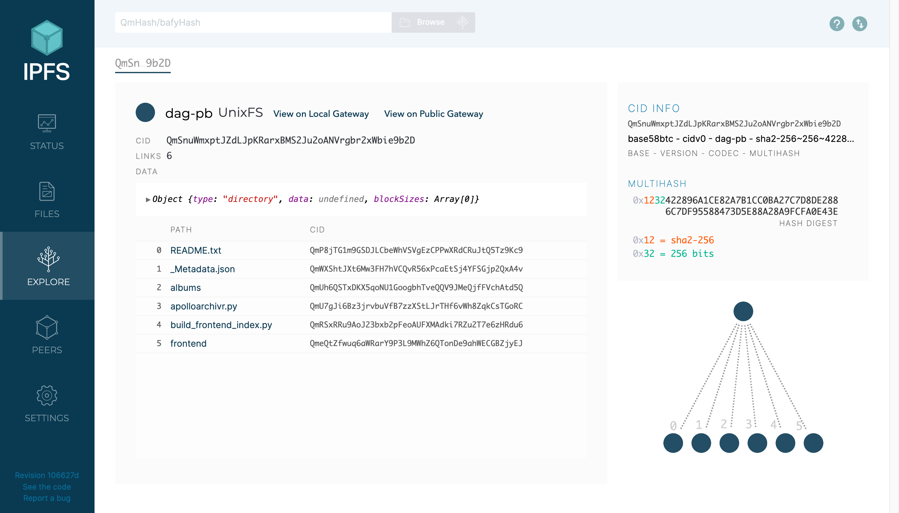
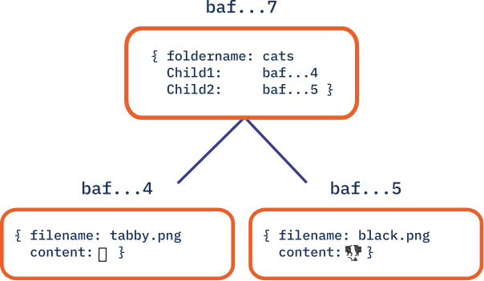
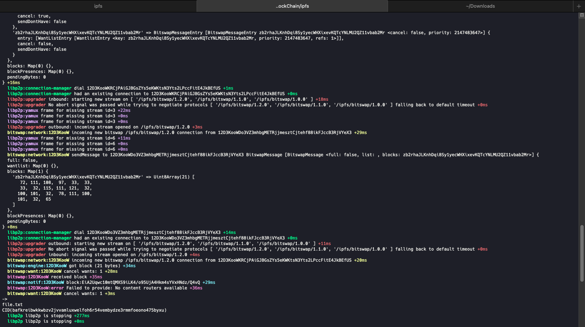

# IPFS


**Project Apollo archive on IPFS Divided into several Merkle DAGs**

This doc contains the ipfs commands and info.

## Contents

- [IPFS](#ipfs)
  - [Contents](#contents)
  - [File Structure](#file-structure)
  - [What is CID ?](#what-is-cid-)
  - [What is Merkle DAG (Directed Acrylic Graphs) ?](#what-is-merkle-dag-directed-acrylic-graphs-)
    - [Example of how merkle DAGs allow us to counter the duplication of content github also uses merkle DAGs to manage the version control without duplication. Ethereum also uses this.](#example-of-how-merkle-dags-allow-us-to-counter-the-duplication-of-content-github-also-uses-merkle-dags-to-manage-the-version-control-without-duplication-ethereum-also-uses-this)
  - [Commands](#commands)
  - [What is IPFS-JS ?](#what-is-ipfs-js-)
  - [What is Helia ?](#what-is-helia-)
  - [CID explorers](#cid-explorers)

## File Structure

- [Assets/](./Assets/)
- [utils/](./utils/)
  - [create_node.js](./utils/create_node.js)
  - [files.js](./utils/files.js)
- [src/](./src/)
  - [index.js](./src/index.js)
  - [nodes_dial.js](./src/nodes_dial.js)
  - [unixfs_nodes.js](./src/unixfs_nodes.js)
- package.json
- Readme.md

Folder Description :

- Assets : Contains all the doc related images or text files
- utils : This folder contains the utility scripts for different IPFS functions such as files module etc.
- src : This folder contains the implementation of the helia nodes and unixfs etc.

Setup :

```sh
yarn
```

## What is CID ?

CID is defined as content identifier.
A CID is a single identifier that contains both a cryptographic hash and a codec, which holds information about how to interpret that data. Codecs encode and decode data in certain formats.

```txt
[source : proto.school]

+-------+------------------------------+
| Codec | Multihash                    |
+-------+------------------------------+


+------------------------------+
| Codec                        |
+------------------------------+
|                              |
| Multihash                    |
| +----------+---------------+ |
| |Hash Type | Hash Value    | |
| +----------+---------------+ |
|                              |
+------------------------------+
```

## What is Merkle DAG (Directed Acrylic Graphs) ?

Merkle DAG are types of graphs that are both Acyclic, Directed and the edge of the Graph is defined by the CID of the entity attached to the node.

We have :

- leaf nodes
- connecting nodes

How data is transformed and how CID is related to the ancestors ?




**Image Source : Proto.school**

Here if I change the contents of a one fish image it's CID will also be changed and it will lead to change of the CID of it's subsequent ancestors till the root node of the graph.

```txt
[source : proto.school]
```

In a Merkle DAG, the CID of each node depends, in turn, on the CIDs of each of its children.
As such, the CID of a root node uniquely identifies not just that node, but the entire DAG of which it’s the root!
As a result, we can extend all of the awesome security, integrity, and permanence guarantees of CIDs to our data structure itself,
and not just the data that it contains!

Have you ever made a temporary backup copy of a file directory during some editing process,
then found the two directories months later and wondered whether their contents were still identical?
Rather than laboriously comparing files, you could compute a Merkle DAG for each copy: if the CIDs of the root directory matched,
you’d know you could safely delete one and free up some space on your hard drive!

### Example of how merkle DAGs allow us to counter the duplication of content github also uses merkle DAGs to manage the version control without duplication. Ethereum also uses this.

For an example of small-scale data duplication, consider the use case of tracking changes files in a directory over time (this is often called versioning).
One change we could make to this directory is to delete the "fish" directory, replacing it with a directory called "dogs".
These changes result in a new DAG, representing an updated state of the directory. However, all of the nodes representing the "cats" directory and its files are common to both DAGs.
Therefore, we can reuse them, as depicted below, where the orange nodes represent nodes that are only used in the original DAG,
the green nodes represent those that are common to both, and the blue nodes represent the extra nodes needed for the new state.


This means that we can actually store both versions of the "pics" directory,
without taking up twice as much space as it takes to store a single version!
Git, a common version control system, uses Merkle DAGs in a very similar way to track changes to source code in software projects!

## Commands

1. **ipfs id**

This command will give the IPFS id.

```sh
ipfs id
```

OUTPUT :

```sh
{
 "ID": "<ID>",
 "PublicKey": "<PUBLIC_KEY>",
 "Addresses": null,
 "AgentVersion": "kubo/0.21.0/",
 "ProtocolVersion": "ipfs/0.1.0",
 "Protocols": null
}
```

2. **ipfs daemon**

This command will run the ipfs daemon on your system

```sh
ipfs daemon
```

OUTPUT :

```sh
Initializing daemon...
Kubo version: 0.21.0
Repo version: 14
System version: amd64/darwin
Golang version: go1.19.10
Swarm listening on /ip4/127.0.0.1/tcp/4001
Swarm listening on /ip4/127.0.0.1/udp/4001/quic
Swarm listening on /ip4/127.0.0.1/udp/4001/quic-v1
Swarm listening on /ip4/127.0.0.1/udp/4001/quic-v1/webtransport/certhash/uEiAjfmrXqorLFs8UwvgyYuZWE6KSptUbxdmXurxbC6Mtew/certhash/uEiDrdsdmj4QFuh_kV0LuNPDB5E_Vk4jixta7HF0dCs90MA
Swarm listening on /ip4/127.94.0.1/tcp/4001
Swarm listening on /ip4/127.94.0.1/udp/4001/quic
Swarm listening on /ip4/127.94.0.1/udp/4001/quic-v1
.....
.....
.....
RPC API server listening on /ip4/127.0.0.1/tcp/5001
WebUI: http://127.0.0.1:5001/webui
Gateway server listening on /ip4/127.0.0.1/tcp/8080
Daemon is ready
```

3. **Add Files**

There are several ways you can add and wrap the files. Run this command to see all the options

```sh
ipfs add --help
```

Ways to add file :

- Using `ipfs add`

```sh
ipfs add <file_path>
```

Eg :

```sh
ipfs add 8-SoNnsagShzqdhbo.png

added QmZNwQ8zpNEUVf4EpSYqTxYfkjHaFV4ipnymHC8LM26jDm 8-SoNnsagShzqdhbo.png
 408.22 KiB / 408.22 KiB [=========================================================================================================================================================================] 100.00%
```

Here the file hash is : `QmZNwQ8zpNEUVf4EpSYqTxYfkjHaFV4ipnymHC8LM26jDm`

- Using `curl` with ipfs api

```sh
curl -F file=@<file_path> "http://127.0.0.1:5001/api/v0/add"
```

Eg :

```sh
ipfs curl -F file=@8-SoNnsagShzqdhbo.png "http://127.0.0.1:5001/api/v0/add"

# Response :

{
    "Name":"8-SoNnsagShzqdhbo.png",
    "Hash":"QmZNwQ8zpNEUVf4EpSYqTxYfkjHaFV4ipnymHC8LM26jDm",
    "Size":"418150"
}
```

## What is IPFS-JS ?

IPFS-JS is a deprecated framework that is used to interact with the IPFS node to add files getting stats

## What is Helia ?

Helia is a new version of ipfs client that is used to interact with the IPFS module and insert data or manipulate our data as we wish. It is a better option than ipfs-js and is very light compared to it.

It majorly contains 4 modules :

- Blockstore
- Datastore
- Pinning
- libp2p

Blockstore :

- put/get blocks
- bitswap backed by local store

Datastore :

- put/get data keys
- IPNS names
- DHT (Distributed Hash Table) provider records

Pinning :

- Garbage Collection

Libp2p :

- Pub/Sub
- DHT
- Protocol Streams

Run files :

```sh
node src/<filename>
```

Helia also gives us a very good option to get the logs of what is happening in the process using some ENV variables

```sh
DEBUG=* node src/unixfs_nodes.js
```

The output will look something like this :



## CID explorers

IPLD EXPLORER : <https://explore.ipld.io/#/explore/bafkreicwbat3xkt2xedhzk4uzfm5ketqsll2kdhlri572vdjlto3bjpzgi>
CID EXPLORER : <https://cid.ipfs.tech/#bafkreicwbat3xkt2xedhzk4uzfm5ketqsll2kdhlri572vdjlto3bjpzgi>
